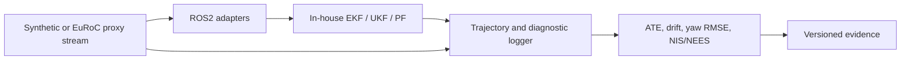

# Aegis Localization

A C++17 and ROS2 platform for implementing and evaluating in-house EKF, UKF, and particle-filter pose estimators under reproducible synthetic sensing, a bounded EuRoC planar proxy, and delayed exteroceptive corrections.

## Overview

Aegis studies corrections measured at time `t_m` but received later at `t_a`. Naive fusion applies the stale correction to the current state. Timestamp-aware replay restores the retained state at `t_m`, applies the correction there, and repropagates motion history to the present. This is a practical problem in robotic pipelines with perception, communication, or compute latency.

Online ATE describes what an estimator published before later information arrived. Final drift describes the current state after received corrections are incorporated; replay does not retroactively change previously published estimates.

## Key Results

All values below are synthetic. Full three-repeat evidence: [Phase 5 report](results/reports/phase5_final_report.md).

| Scenario | Estimator | Result |
| --- | --- | --- |
| 1.0 s delayed correction | EKF / UKF | Replay reduced final drift from `0.3005 m` to `0.0552 m` (about 82%). |
| 1.0 s delayed correction | EKF / UKF | Naive online ATE was about `0.440 m`; replay was about `0.097 m`. |
| Injected outliers | EKF | Gating reduced ATE from `0.2342 +/- 0.0414 m` to `0.0709 +/- 0.0059 m`. |
| 3 s correction blackout | EKF / UKF | Peak error was about `0.138 m`; error one second after recovery was about `0.054 m`. |
| Combined degradation | EKF / UKF | ATE was `0.0967 +/- 0.0178 m`, versus `0.0539 +/- 0.0098 m` for reference. |

## Architecture



- `aegis_core`: ROS-independent C++ estimator mathematics and unit tests.
- `aegis_ros`: ROS2 nodes, correction replay, launch files, and synthetic sensors.
- `aegis_msgs`: diagnostic message definitions.
- `python/aegis_eval`: shared trajectory and consistency evaluation.
- `python/aegis_bench`: normalized benchmark schema and EuRoC adapter.

See [architecture](docs/architecture.md), [benchmark scenarios](docs/benchmark_scenarios.md), [EuRoC method](docs/euroc_backend.md), and [run schema](docs/run_schema.md).

## Capabilities

- In-house planar EKF, UKF, and particle-filter estimators.
- Synthetic noise, dropout, pose corrections, latency, blackout, and injected outliers.
- Timestamp-aware out-of-sequence correction replay for EKF, UKF, and PF; deterministic correctness checks cover EKF/UKF.
- EKF/UKF NIS diagnostics, synthetic planar NEES, and Mahalanobis pose-update gating.
- One EuRoC `MH_01_easy` planar proxy through the shared evaluation path.
- TurtleBot3 Gazebo launch and logging for ROS2 integration.

## Installation

ROS 2 Humble on Ubuntu is the supported runtime:

```bash
source /opt/ros/humble/setup.bash
cd ros2_ws
rosdep install --from-paths src --ignore-src -r -y
colcon build --symlink-install
source install/setup.bash
```

Python 3 and NumPy are required for evaluation. Matplotlib is optional.

## Reproducing Results

Run from the repository root after building the workspace:

```bash
# Synthetic benchmark and consistency artifacts
python3 scripts/run_fake_benchmark_campaign.py --duration 20 --repeats 5

# Gating and delayed-correction validation
python3 scripts/run_phase4_gating_experiment.py --duration 20 --repeats 5
python3 scripts/run_phase5_correctness_checks.py --duration 8
python3 scripts/generate_phase5_correctness_report.py

# Principal latency comparison and degradation campaign
python3 scripts/run_phase5_replay_comparison.py --duration 12 --repeats 3
python3 scripts/run_phase5_degradation_campaign.py --duration 12 --repeats 3
python3 scripts/generate_phase5_final_report.py
```

For a locally supplied EuRoC sequence:

```bash
python3 scripts/run_euroc_benchmark.py --sequence-root /path/to/MH_01_easy
```

## Repository Structure

```text
ros2_ws/src/           ROS2 packages and C++ estimator implementation
python/                shared evaluation and benchmark packages
scripts/               reproducible experiment and reporting entry points
docs/                  technical design and methodology
results/reports/       preserved experimental evidence
results/*/summary.json compact machine-readable summaries
tests/                 Python and C++ tests
```

## Validation Scope And Limitations

- Evidence is simulation and recorded-data proxy evaluation only; no hardware validation is claimed.
- Gazebo is an integration path, not quantitative benchmark evidence, because its ground-truth scoring bridge is unreliable.
- EuRoC is one planar proxy sequence, not native 6-DoF MAV localization; yaw conclusions are limited.
- PF resampling is stochastic, so exact EKF/UKF replay-equivalence expectations do not apply.
- Combined-degradation NIS is unavailable in the preserved campaign because it predates a diagnostic logging correction; it is not inferred. Focused validation confirms one NIS record per applied EKF/UKF correction.

## Testing

```bash
source /opt/ros/humble/setup.bash
cd ros2_ws
colcon test --packages-select aegis_core aegis_ros
colcon test-result --verbose
```

Python checks are under `tests/`; script syntax can be checked with `python3 -m py_compile scripts/*.py`.
