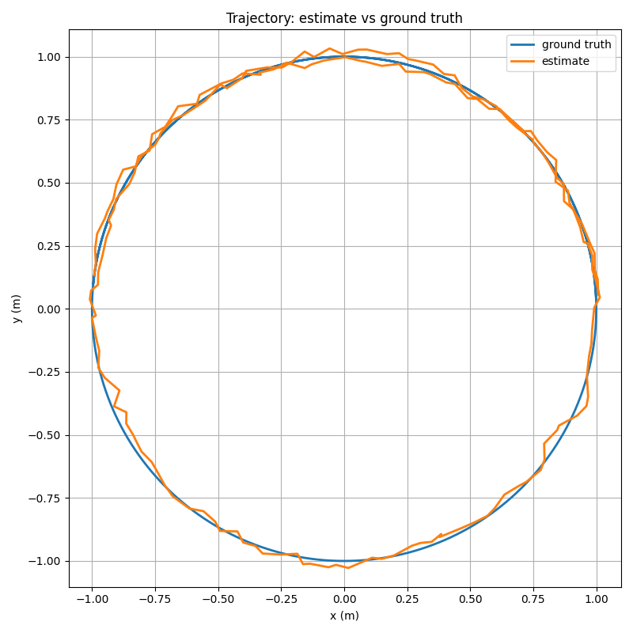

# Aegis Localization

C++ ROS2 multi-sensor localization and state-estimation framework for autonomous robots.

Aegis Localization implements and benchmarks classical robotics estimation methods for real-time robot pose estimation using wheel odometry, IMU, and simulator-derived ground truth.

## Features

- C++17 ROS2 localization stack
- Extended Kalman Filter (EKF)
- Unscented Kalman Filter (UKF)
- Particle Filter localization
- Odometry + IMU fusion
- Synthetic sensor benchmark with configurable noise/dropout
- Reproducible multi-scenario benchmark campaign
- Ground-truth trajectory logging
- ATE/drift/yaw RMSE evaluation
- NIS consistency analysis for EKF and UKF synthetic runs
- Pose-update gating experiment path for corrupted synthetic corrections
- Intermittent timestamped pose corrections with bounded out-of-sequence replay
- Phase 5 replay-correctness evidence for EKF and UKF
- Trajectory plotting

## Planned

- GTSAM pose graph optimization

## Project Structure

- `ros2_ws/src/aegis_core` - filter math library
- `ros2_ws/src/aegis_ros` - ROS2 nodes, launch files, configs
- `ros2_ws/src/aegis_msgs` - custom diagnostics messages
- `scripts/` - evaluation, plotting, and benchmark helpers
- `docs/` - architecture, experiment notes, benchmark results, and resume bullets
- `results/` - generated metrics and plots

## Setup

```bash
cd aegis-localization
source /opt/ros/humble/setup.bash
rosdep update
rosdep install --from-paths ros2_ws/src --ignore-src -r -y
cd ros2_ws
colcon build --symlink-install
source install/setup.bash
```

## Run Filters

EKF:

```bash
cd ros2_ws
source install/setup.bash
ros2 launch aegis_ros ekf_localization.launch.py
```

UKF:

```bash
cd ros2_ws
source install/setup.bash
ros2 launch aegis_ros ukf_localization.launch.py
```

Particle Filter:

```bash
cd ros2_ws
source install/setup.bash
ros2 launch aegis_ros particle_filter_localization.launch.py
```

## Synthetic Benchmark

The default synthetic benchmark launches the fake sensor publisher, EKF, UKF, particle filter, and the trajectory logger:

```bash
cd ros2_ws
source /opt/ros/humble/setup.bash
source install/setup.bash
ros2 launch aegis_ros fake_benchmark.launch.py
```

You can disable individual estimators with `run_ekf:=false`, `run_ukf:=false`, or `run_pf:=false`.

Scenario presets are documented in `docs/benchmark_scenarios.md`. Three especially useful runs are:

Low noise:

```bash
ros2 launch aegis_ros fake_benchmark.launch.py odom_position_noise_std:=0.03 odom_velocity_noise_std:=0.02 imu_yaw_rate_noise_std:=0.01 dropout_probability:=0.0
```

High noise + 20% dropout:

```bash
ros2 launch aegis_ros fake_benchmark.launch.py odom_position_noise_std:=0.15 odom_velocity_noise_std:=0.10 imu_yaw_rate_noise_std:=0.05 dropout_probability:=0.2
```

Dead reckoning stress test:

```bash
ros2 launch aegis_ros fake_benchmark.launch.py use_odom_pose_update:=false
```

To reproduce the packaged benchmark campaign from the repository root:

```bash
cd /path/to/Aegis-Localization
python3 scripts/run_fake_benchmark_campaign.py --duration 20
```

To generate repeated synthetic evidence with uncertainty consistency summaries:

```bash
cd /path/to/Aegis-Localization
python3 scripts/run_fake_benchmark_campaign.py --duration 20 --repeats 5
```

In addition to trajectory metrics, each run now logs `filter_diagnostics.csv` and computes:

- per-update NIS for EKF and UKF pose and velocity/yaw-rate updates
- 95% chi-square consistency bounds
- fraction of updates inside bounds
- synthetic-only planar NEES summaries where the covariance interpretation is clean enough

For the Phase 4 robustness path, you can run:

```bash
cd /path/to/Aegis-Localization
python3 scripts/run_phase4_gating_experiment.py --duration 20 --repeats 5
```

That experiment injects corrupted pose-like corrections into the synthetic benchmark and compares EKF/UKF behavior with pose gating disabled versus enabled.

## Results

Packaged scenario summaries currently live in `results/campaign/summary.json`, and selected evidence plots live in `docs/assets/`.

Repeated-run synthetic campaign artifacts now also preserve:

- per-run `filter_diagnostics.csv`
- per-run `consistency_summary.json`
- NIS time-series plots when matplotlib is available
- scenario-level aggregated NIS and planar NEES summaries inside `results/campaign/summary.json`

Headline results from the packaged benchmark campaign:

### Low Noise

| Method | ATE RMSE | Final Drift | Yaw RMSE | Update Rate |
|---|---:|---:|---:|---:|
| EKF | 0.0420 m | 0.0159 m | 0.0245 rad | 9.71 Hz |
| UKF | 0.0418 m | 0.0159 m | 0.0243 rad | 9.71 Hz |
| Particle Filter | 0.0252 m | 0.0084 m | 0.0016 rad | 9.71 Hz |

### High Noise + 20% Dropout

| Method | ATE RMSE | Final Drift | Yaw RMSE | Update Rate |
|---|---:|---:|---:|---:|
| EKF | 0.1181 m | 0.0410 m | 0.0686 rad | 10.23 Hz |
| UKF | 0.1010 m | 0.1001 m | 0.0655 rad | 10.23 Hz |
| Particle Filter | 0.1102 m | 0.2013 m | 0.0767 rad | 10.23 Hz |

### Dead Reckoning (`use_odom_pose_update:=false`)

| Method | ATE RMSE | Final Drift | Yaw RMSE | Update Rate |
|---|---:|---:|---:|---:|
| EKF | 0.1257 m | 0.1368 m | 0.0918 rad | 10.20 Hz |
| UKF | 0.1257 m | 0.1368 m | 0.0918 rad | 10.20 Hz |
| Particle Filter | 0.1100 m | 0.0576 m | 0.0924 rad | 10.20 Hz |

Takeaways:

- PF is strongest in the easy synthetic case and remains most stable in the dead-reckoning stress test.
- UKF delivers the best ATE in the high-noise dropout scenario, though EKF holds lower final drift there.
- All three methods sustain roughly 10 Hz in the current ROS2 wrappers, so the comparison is mostly about estimator behavior rather than raw loop speed.



## Evaluate and Plot

```bash
cd /path/to/Aegis-Localization
python3 scripts/evaluate_trajectory.py --est results/metrics/ekf.csv --gt results/metrics/ground_truth.csv
python3 scripts/evaluate_trajectory.py --est results/metrics/ukf.csv --gt results/metrics/ground_truth.csv
python3 scripts/evaluate_trajectory.py --est results/metrics/pf.csv --gt results/metrics/ground_truth.csv
python3 scripts/plot_trajectories.py --est results/metrics/ekf.csv --gt results/metrics/ground_truth.csv --out results/plots/ekf_vs_ground_truth.png
python3 scripts/plot_trajectories.py --est results/metrics/pf.csv --gt results/metrics/ground_truth.csv --out results/plots/pf_vs_ground_truth.png
```

These commands are intended for the synthetic benchmark outputs under `results/metrics/`. Gazebo integration should write to `results/gazebo_metrics/` so incomplete simulator ground truth does not overwrite the synthetic baseline.

For consistency analysis, the synthetic benchmark also writes `results/metrics/filter_diagnostics.csv`, which the campaign runner promotes into each preserved repeat artifact.

## TurtleBot3 Gazebo Validation

Headless TurtleBot3 Gazebo integration is available through a dedicated launch:

```bash
cd ros2_ws
source /opt/ros/humble/setup.bash
source install/setup.bash
ros2 launch aegis_ros gazebo_validation.launch.py gui:=false
```

This launch:

- starts TurtleBot3 Burger in Gazebo Classic
- drives a repeatable circular `cmd_vel` profile
- runs EKF, UKF, and particle-filter estimators on simulated `/odom` and `/imu`
- reuses the same trajectory logger and CSV pipeline as the synthetic benchmark

Current Gazebo status:

- launch integration is intended to run in WSL with installed TurtleBot3 and Gazebo packages
- estimator trajectories can be logged from simulation
- Gazebo logs should be treated as separate outputs under `results/gazebo_metrics/`
- quantitative Gazebo scoring should still be treated as incomplete until the simulator ground-truth bridge reliably produces a populated `ground_truth.csv`

Gazebo is therefore an integration/demo path, not a source of benchmark claims in the current project direction.

## Intermittent Correction And Delayed Replay

The synthetic benchmark can inject timestamped pose-like corrections with configurable frequency, dropout, latency, noise, and outliers. EKF and UKF apply delayed corrections at their measurement timestamp and replay stored odometry forward; corrections outside the retained history are explicitly rejected.

To reproduce the focused Phase 5 artifacts after building the ROS workspace:

```bash
cd /path/to/Aegis-Localization
python3 scripts/run_phase5_correctness_checks.py --duration 8
python3 scripts/generate_phase5_correctness_report.py
python3 scripts/run_phase5_intermittent_correction_experiment.py --duration 12
python3 scripts/generate_phase5_report.py
```

The correctness checks show that, for deterministic EKF/UKF cases, zero-latency replay agrees with immediate fusion and terminal state/covariance remain invariant for 100 ms, 500 ms, and 1000 ms delayed arrivals. They also cover reversed correction arrival order and clean rejection of corrections older than the retained history window.

The delayed-run trajectory remains an online record: estimates published before a correction arrives cannot be retroactively improved. Whole-trajectory error and reconstructed current-state correctness are therefore reported as distinct concepts. See `results/reports/phase5_correctness.md` and `results/reports/phase5_intermittent_correction.md` for the preserved evidence.

## EuRoC Recorded-Data Benchmark

A minimal recorded-data backend is now available for one EuRoC sequence at a time through the same evaluation pipeline used by the synthetic benchmark:

```bash
python scripts/run_euroc_benchmark.py --sequence-root C:\path\to\MH_01_easy --run-name full_mh01_ready
```

Current scope and caveats:

- this is a planar proxy benchmark, not a native 6-DoF MAV localization benchmark
- EuRoC ground truth is reduced to planar `x`, `y`, and `yaw`
- planar linear velocities are derived from ground-truth position differences
- IMU yaw rate is mirrored into `/odom.twist.angular.z` for compatibility with the current ROS wrappers
- plotting is optional and benchmark generation still succeeds even if the local matplotlib stack is broken

Important preserved artifacts live under:

- `results/euroc/MH_01_easy/full_mh01/`
- `results/euroc/MH_01_easy/full_mh01_diag/`
- `results/euroc/MH_01_easy/full_mh01_ready/`
- `results/euroc/MH_01_easy/full_mh01_phase1_accounted/`

The current recorded-data findings are intentionally mixed rather than polished:

- EKF and UKF now complete the faithful `MH_01_easy` replay with nearly identical translational metrics under the current proxy definition
- the earlier UKF crash was traced to unscaled per-step process noise at high replay rates plus an overly aggressive `alpha=0.1` sigma-point setting that produced a very negative central covariance weight
- the current accounted run still shows a small logged-sample shortfall versus replay publication, now narrowed to shutdown/write-path behavior rather than estimator failure
- translational error can look excellent while yaw error remains large, so yaw conclusions should still be treated cautiously and not presented as the strongest result of the proxy benchmark

For the benchmark-specific methodology and interpretation notes, see `docs/euroc_backend.md` and each run-local `benchmark_report.md`.

The cleanest external-data claim for the repo is:

- Aegis supports a reproducible planar recorded-data benchmark on one public EuRoC sequence using the same shared evaluation path as its synthetic benchmark.

The repo should not claim:

- full EuRoC validation as a native MAV localizer
- hardware validation
- strong yaw validation from the current planar proxy alone

## Notes

The localization nodes initialize from the first odometry pose, optionally apply odometry pose corrections through `use_odom_pose_update`, fuse `/odom` and `/imu`, and publish filter-specific pose/path topics for benchmarking.
